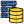
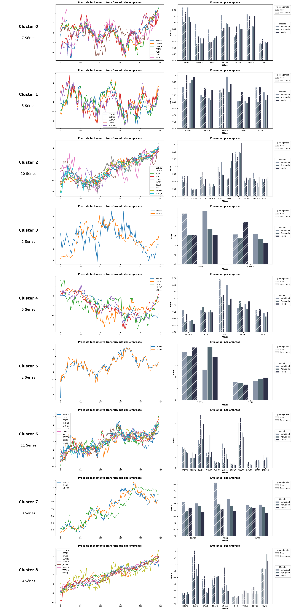

<div align="center" id="top"> 
  &#xa0;
</div>


<!-- Titulo -->
<h1 align="center">Prediction of stocks with neural network algorithms</h1>


<!-- Icones iniciais -->
<p align="center">
  

  

  

  <!--  -->

  <!-- 

  

   -->
</p>

<!-- Status -->

<!-- <h4 align="center"> 
	🚧  Fitclub 🚀 Em construção...  🚧
</h4> 

<hr> -->


<!-- Topicos -->
<p align="center">
  <a href="#dart-sobre">About</a> &#xa0; | &#xa0; 
  <a href="#sparkles-funcionalidades">Features</a> &#xa0; | &#xa0;
  <a href="#rocket-tecnologias">Technologies</a> &#xa0; | &#xa0;
  <a href="#white_check_mark-pré-requisitos">Requirements</a> &#xa0; | &#xa0;
  <a href="#checkered_flag-começando">Getting Started</a> &#xa0; | &#xa0;
  <a href="#memo-licença">License</a> &#xa0; | &#xa0;
  <a href="https://github.com/claudioestevam7" target="_blank">Author</a>
</p>

<br>


## :dart: About

This project was created with the goal of assisting artificial intelligence models in predicting stock prices in the financial market. To achieve this, artificial neural networks, clustering techniques, time series analysis, and a database were employed.

Main tools: [TensorFlow](https://www.tensorflow.org/?hl=pt-br), [Keras](https://keras.io/), [Pandas](https://pandas.pydata.org/), [NumPy](https://numpy.org/), [Matplotlib](https://matplotlib.org/), [database](https://www.sqlite.org/index.html)


## :sparkles: Features

:heavy_check_mark: Intelligent models;\
:heavy_check_mark: explained code;\
:heavy_check_mark: graphical results.


## :rocket:  Technologies

The following tools were used in the construction of the project:

-  &#xa0; [Python](https://www.python.org/)
-  &#xa0; [Artificial Intelligence](https://keras.io/)
-  &#xa0; [Database](https://pandas.pydata.org/)

## :white_check_mark: Requirements

Before you begin :checkered_flag:, you need to have [Git](https://git-scm.com) and [Python](https://www.python.org/) installed on your machine.


## :checkered_flag: Getting Started 

```bash
# Clone this repository
$ git clone https://github.com/claudioestevam7/prediction-of-stocks-with-neural-network-algorithms

# Install the dependencies
$ pip install -r requirements.txt
```

## :memo: License

This project is under the MIT license.

## :rocket: Results




Made by <a href="https://github.com/claudioestevam7" target="_blank">Cláudio Estevam</a>.

&#xa0;

<a href="#top">Voltar para o topo</a>